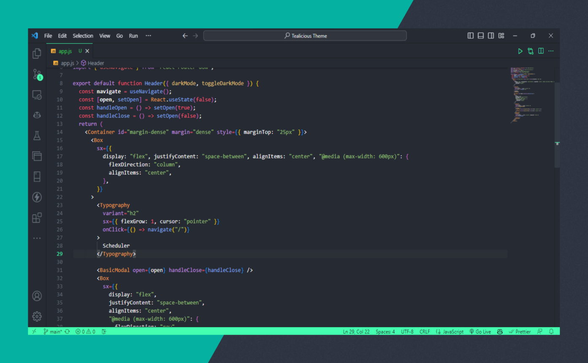

 
    
    <h1 align="center">Tealicious Theme 🌊💻</h1>

Welcome to Tealicious Theme! 🌈 Add a splash of vibrant teal to your coding environment and dive into a world of colorful creativity! Let the waves of inspiration guide your code. 🌊✨

## Features

- Beautiful and harmonious blend of soothing blues and lush greens.
- Clean and intuitive syntax highlighting, inspired by the tokenization highlighting of the beloved GitHub theme.
- Optional accent colors to personalize your workspace.
- Designed to provide a balanced and elegant coding experience.

## Screenshot

## Installation

1. Launch Visual Studio Code.
2. Go to the **Extensions** view by clicking on the square icon in the sidebar or using the shortcut `Ctrl+Shift+X`
3. Search for "Tealicious Theme" in the extensions marketplace.
4. Click **Install** to bring the magic of Tealicious to your coding journey.
5. Once installed, go to **File** > **Preferences** > **Color Theme** and select "Tealicious" from the dropdown menu.

## Feedback and Contributions

We value your feedback! If you encounter any issues, have suggestions, or want to contribute to Tealicious Theme, please visit the [GitHub repository](https://github.com/cocomo29/Tealicious). Your input and contributions are greatly appreciated!

## License

This theme is licensed under the [MIT License](LICENSE.md). Feel free to spread the Tealicious goodness everywhere! 🎉

Happy coding with Tealicious! Dive into the sea of creativity and let your code ride the waves. 🌊💻
